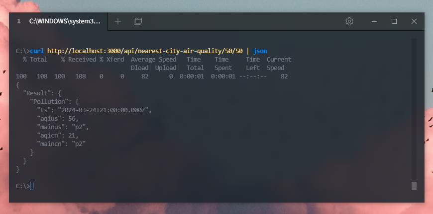
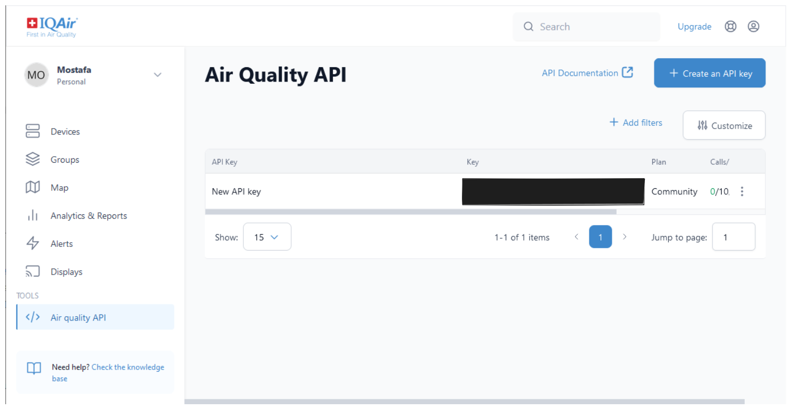
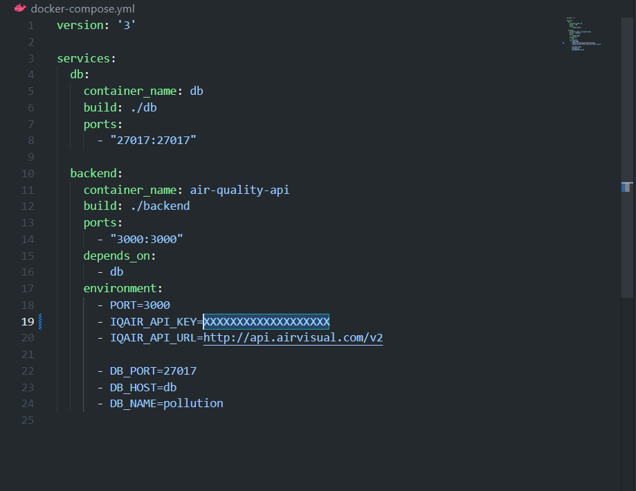

# Air Quality API <!-- omit in toc -->

A simple Node.js REST API to retrieve air quality information using GPS co-ordinates.



## Contents <!-- omit in toc -->
- [Installation](#installation)
  - [Getting an IQAir API Key](#getting-an-iqair-api-key)
  - [With Docker](#with-docker)
  - [Without Docker](#without-docker)
- [Technologies Used](#technologies-used)
- [Project Structure](#project-structure)
  - [Endpoints](#endpoints)
  - [Integration with IQAir](#integration-with-iqair)
  - [CRON Job](#cron-job)
- [Tests](#tests)


## Installation

### Getting an IQAir API Key

An API key from IQAir is required to run this API. 

Register for an account [here](https://dashboard.iqair.com/auth/sign-up), then generate a free API key for a community plan [from the dashboard](https://dashboard.iqair.com/personal/api-keys).



### With Docker

The fastest way to get started is by using docker compose.

Make sure that `docker compose` installed on your system by following the instructions [here](https://docs.docker.com/compose/install/)

Add the generated IQAir API key in `docker-compose.yml` under the environment variables section for backend.



Then, run the following command in the repository root:

```Bash
docker compose up --build
```

By default, the API will be accessible on port 3000.

### Without Docker

To run without Docker, you will need Node.js 20 & an instance of MongoDB running locally.

Copy `.env.example` and rename to `.env`, add the generated IQAir API key and update values for DB connection.

Then run the following commands:

```Bash
// in `/backend` directory

npm install

npm run build

npm run start
```

## Technologies Used

- [Typescript](https://www.typescriptlang.org/), JavaScript with types.
- [Express](https://expressjs.com/), a web framework for Node.js.
- [Node Cron](https://github.com/kelektiv/node-cron), a job scheduler for Node.js with Crontab like syntax.
- [MongoDB](https://www.mongodb.com/), NoSQL DB for storing CRON job results.
- [Joi](https://joi.dev/), for data validation.
- [Jest](https://jestjs.io/), testing framework for running integration & unit tests.
- [Docker](https://www.docker.com/), for containerizing backend & DB. 

## Project Structure

```
backend
.
├── backend/
│   ├── src/
│   │   ├── air-quality/    -routes, service & model for air quality measurements
│   │   ├── cron/           -cronjob for polling Paris data every minute
│   │   ├── db/             -db connection
│   │   └── iqair-api/      -integration with IQAir
│   └── test/
│       ├── unit/
│       ├── integration/
│       └── mocks/
└── db/
```

### Endpoints

API exposes the following endpoints

- `GET /api/nearest-city-air-quality/:latitude/:longitude`
  - Returns air quality of nearest city to specified co-ordinates.
- `GET /api/peak-pollution-time`
  - Returns timestamp of highest value for AQI(Air Quality Index) from saved CRON job results [^1]


[^1]: Values for AQI range 0 - 500, 0 being clean air & 500 being hazardous.

### Integration with IQAir

Integration with IQAir is in `/backend/iqair-api`, it consists of the following components:

- `client.ts`, axios instance used for all API calls.
- `types.ts`, interfaces and type definitions for responses from IQAir.
- `api.ts`, calls to API that integrate endpoints from IQAir.

The following endpoints are currently integrated: 

- [Get nearest city data (GPS coordinates)](https://api-docs.iqair.com/?version=latest#5ea0dcc1-78c3-4939-aa80-6d4929646b82)

### CRON Job

The CRON job is implemented in `/backend/cron`. 

A simple function that requests air quality data for Paris then saves results using MongoDB model along with time of fetching data.

It is scheduled to run every minute using node-cron.

## Tests

Run unit and integration tests using the following commands:

```
// in /backend

// runs all suites
npm run test

// run unit tests only
npm run test:unit

// run integration tests only
npm run test:integration
```